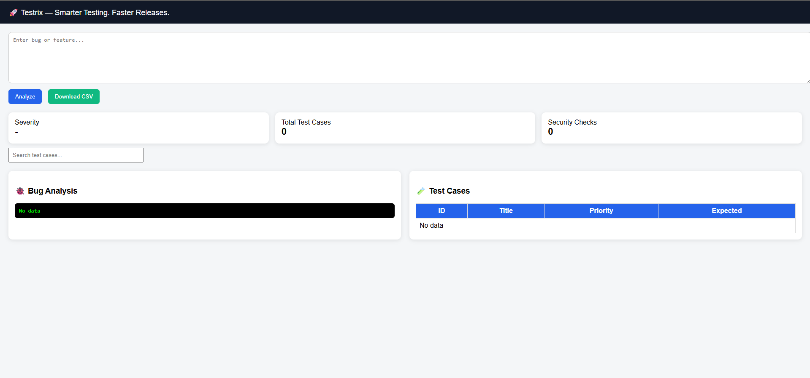

# 🚀 Testrix — AI-Powered QA Intelligence Platform


Testrix is an intelligent QA system that uses **AI + RAG + Agents** to automate software testing workflows.

It goes beyond traditional automation by:

* Understanding bugs
* Generating test cases
* Suggesting fixes
* Performing security-focused QA analysis

---

## 📸 Dashboard



---

## ✨ Key Features

* 🧠 AI Bug Analysis (Root cause + Fix suggestion)
* 🧪 Smart Test Case Generation (Positive / Negative / Edge)
* 🔐 Security Testing (SQL Injection, XSS, Rate Limiting)
* ⚡ RAG-based Context Awareness (logs, bugs, history)
* 🤖 Agent-based Architecture (modular QA intelligence)
* 📊 SaaS Dashboard UI

---

## 🚀 Live Demo Flow

1. Open dashboard
2. Enter bug like:

```
Login API returns 500 error on invalid credentials
```

3. Click **Analyze**

### Output:

* Bug severity
* Root cause
* API test cases
* Security tests
* Fix suggestion

---

## 🏗️ Architecture

```
User Input
   ↓
Agent Manager
   ↓
-------------------------
| Bug Agent             |
| Test Case Agent       |
| Security Agent        |
-------------------------
   ↓
LLM (Groq/OpenAI)
   ↓
Structured JSON Output
   ↓
Dashboard UI
```

---

## 🛠️ Tech Stack

* **Backend:** FastAPI (Python)
* **AI Layer:** LLM (Groq / OpenAI)
* **RAG:** Vector search (context-based QA)
* **Frontend:** HTML, CSS, JS (Dashboard)
* **Architecture:** Agent-based system

---

## 📂 Project Structure

```
testrix/
│
├── agents/                # AI agents
├── ai_engine/             # LLM integration
├── rag/                   # context + vector search
├── services/              # business logic
├── ui/                    # dashboard UI
├── app.py                 # FastAPI entry
├── requirements.txt
├── README.md
└── .gitignore
```

---

## ⚙️ Setup & Run

### 1. Clone repository

```bash
git clone https://github.com/suranivimal/testrix.git
cd testrix
```

---

### 2. Install dependencies

```bash
pip install -r requirements.txt
```

---

### 3. Add API Key

Create `.env` file:

```env
GROQ_API_KEY=your_api_key_here
```

---

### 4. Run server

```bash
uvicorn app:app --reload
```

---

## 🌐 Access

* API Docs:
  http://127.0.0.1:8000/docs

* Dashboard UI:
  http://127.0.0.1:8000/ui/index.html

---

## 🧪 Example Use Case

**Input:**

```
Login API returns 500 error on invalid credentials
```

**Output:**

* Severity: Critical
* Root Cause: Error handling issue
* API Test Cases
* Security Tests
* Fix Suggestions

---

## 🔮 Future Enhancements

* 🔐 User authentication (multi-user SaaS)
* 🗂️ History tracking (database)
* ⚙️ CI/CD integration
* 🤖 Playwright/Selenium auto execution
* ☁️ Cloud deployment (Render / Railway)

---

## 💡 Why Testrix?

Testrix transforms QA from:

* Manual testing ❌
* Static automation ❌

Into:

* Intelligent QA decisions ✅
* Automated insights ✅

---

## 👨‍💻 Author

Built by Vimal Surani🚀
